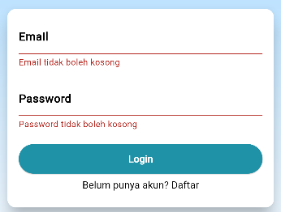
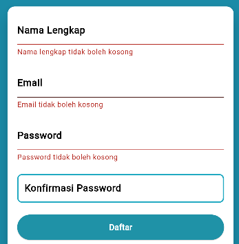

NAMA: MOH. ARBI ARDIANSYAH

NIM : 362358302150

KELAS : 2B

PRODI :TEKNOLOGI REKAYASA PERANGKAT LUNAK

---

                                    PROJECT UJIAN TENGAH SEMESTER 3 TAHUN 2024
                                          MATA KULIAH MOBILE-DEVELOPMENT

---

#DAFTAR ISI:

A.HASIL AKHIR

B.FORM VALIDASI

C.DESKRIPSI PROGRAM

---

A.HASIL AKHIR

1.TAMPILAN LOGIN PAGE :

#PENJELASAN : 

Sesuai perintah project yang diberikan, pengguna pertama kali  akan ditampilkan halaman login.
Halaman login ini akan menampilkan form login yang terdiri dari 2 inputan yaitu  username dan password.
Apabila pengguna belum memiliki akun maka terdapat tombol untuk  registrasi.

2.TAMPILAN REGISTER PAGE :

#PENJELASAN :

Pada halaman  register, pengguna dapat mengisi form register yang terdiri dari 4 inputan yaitu  username, password, email, dan konfirmasi password. Apabila  pengguna telah mengisi form register dengan benar maka pengguna dapat melakukan registrasi. Dan ketika sudah melakukan registrasi  maka pengguna akan diarahkan ke halaman login.

3.TAMPILAN WELCOME PAGE :

#PENJELASAN : Ketika sudah berhasil login dengan  menggunakan akun yang telah dibuat, maka pengguna akan diarahkan ke halaman welcome. Dan  pada halaman welcome ini pengguna dapat melihat username yang telah digunakan. Dan juga terdapat  tombol untuk keluar.

B.VALIDASI AUNTENTIKASI

1. FORM LOGIN :

2. FORM REGISTER :

C.DESKRIPSI PROGRAM

1.LOGIN PAGE

-KODE PROGRAM TAMPILAN ATAS :

#HASIL :

-KODE PROGRAM TAMPILAN FORM LOGIN :

#HASIL :

-KODE PROGRAM TAMPILAN ICON MEDIA SOSIAL SAYA :

#HASIL :

2.KODE PROGRAM REGISTER PAGE

-KODE PROGRAM TAMPILAN FORM REGISTER :

#HASIL :

3.KODE PROGRAM  WELCOME PAGE

-KODE PROGRAM TAMPILAN TEXT ATAS :

#HASIL :

-KODE PROGRAM TAMPILAN TEXT SELAMAT DATANG (NAMA PENGGUNA) :

#HASIL :

-KODE PROGRAM TAMPILAN TOMBOL LOGOUT :

#HASIL :

