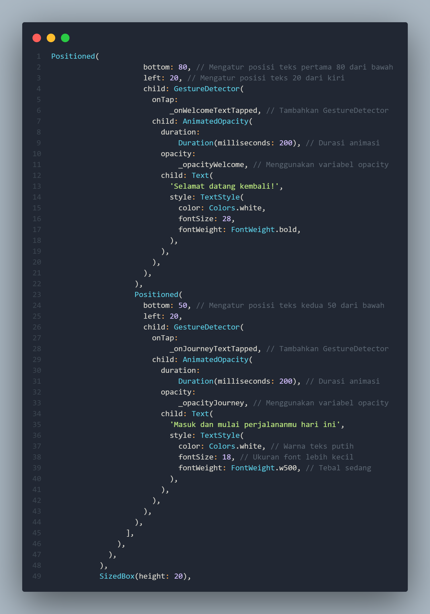
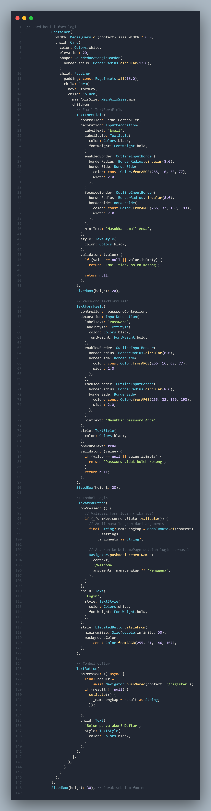
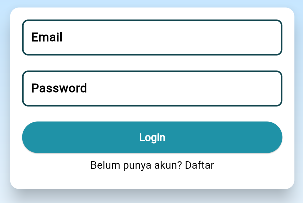
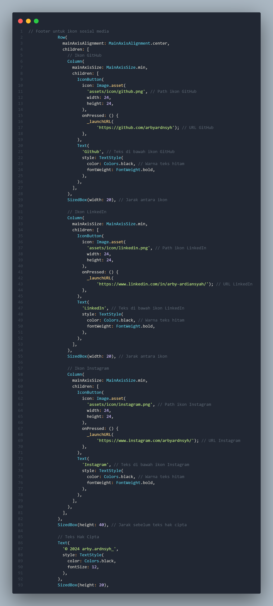
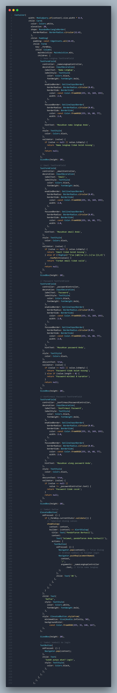
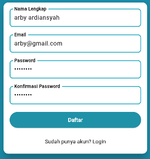
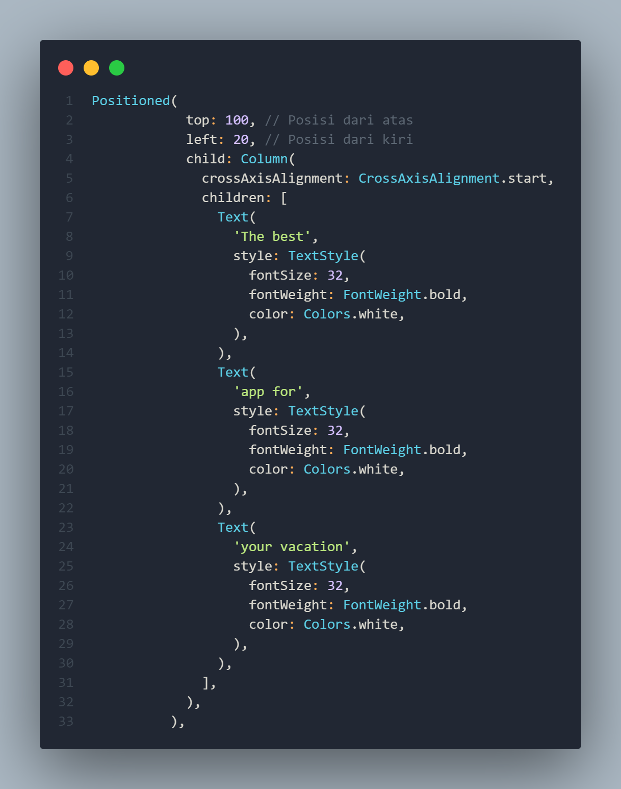
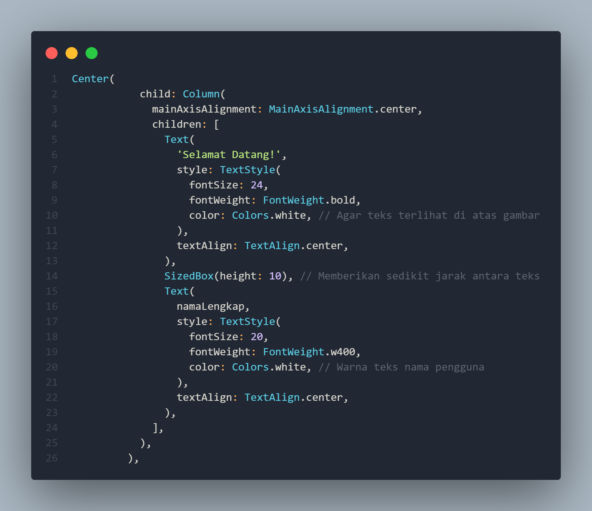
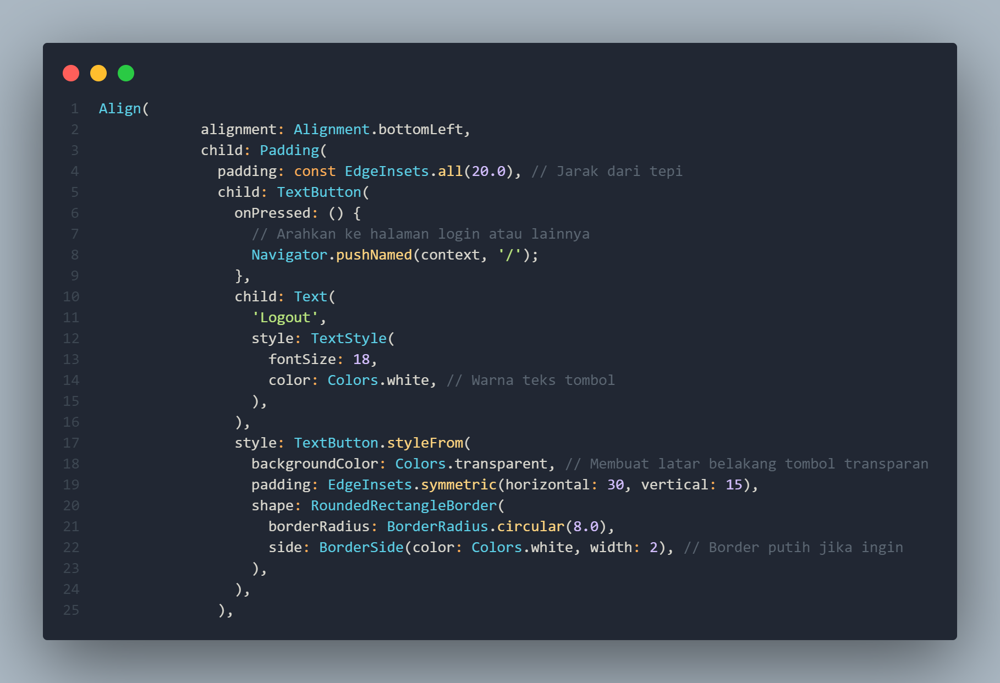

NAMA: MOH. ARBI ARDIANSYAH

NIM : 362358302150

KELAS : 2B

PRODI :TEKNOLOGI REKAYASA PERANGKAT LUNAK

---

                                    PROJECT UJIAN TENGAH SEMESTER 3 TAHUN 2024
                                          MATA KULIAH MOBILE-DEVELOPMENT

---

#DAFTAR ISI:

A.HASIL AKHIR

B.DESKRIPSI PROGRAM

---

A.HASIL AKHIR

1.TAMPILAN LOGIN PAGE :

2.TAMPILAN REGISTER PAGE :

3.TAMPILAN WELCOME PAGE :

B.DESKRIPSI PROGRAM

1.LOGIN PAGE

-KODE PROGRAM TAMPILAN ATAS :

#HASIL :

-KODE PROGRAM TAMPILAN FORM LOGIN :

#HASIL :

-KODE PROGRAM TAMPILAN ICON MEDIA SOSIAL SAYA :

#HASIL :

2.KODE PROGRAM REGISTER PAGE

-KODE PROGRAM TAMPILAN FORM REGISTER :

#HASIL :

3.KODE PROGRAM  WELCOME PAGE

-KODE PROGRAM TAMPILAN TEXT ATAS :

#HASIL :

-KODE PROGRAM TAMPILAN TEXT SELAMAT DATANG (NAMA PENGGUNA) :

#HASIL :

-KODE PROGRAM TAMPILAN TOMBOL LOGOUT :

#HASIL :

